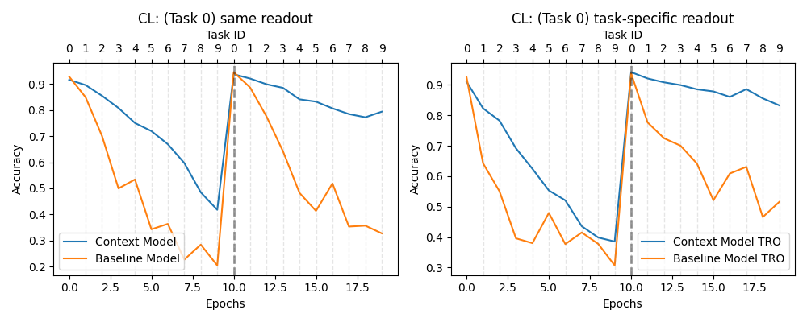
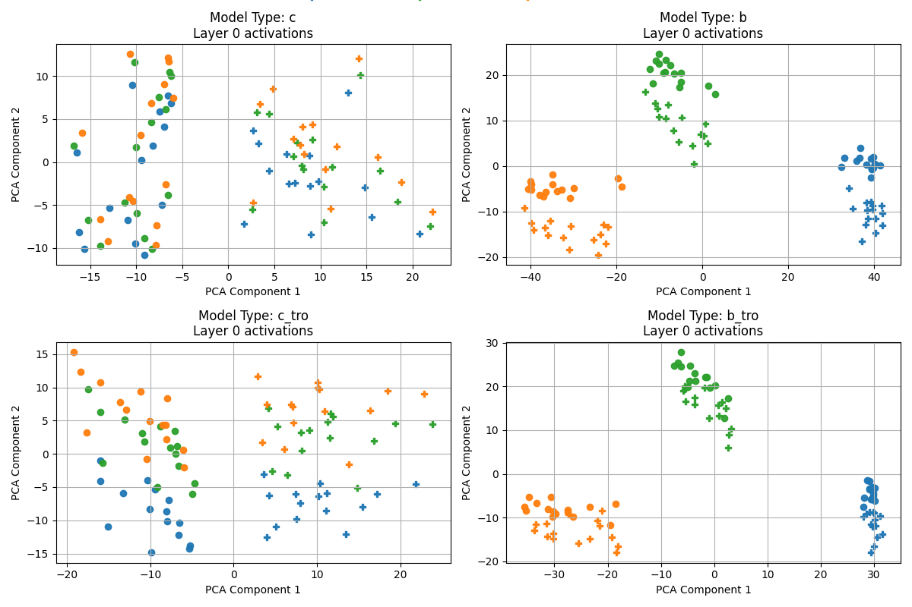
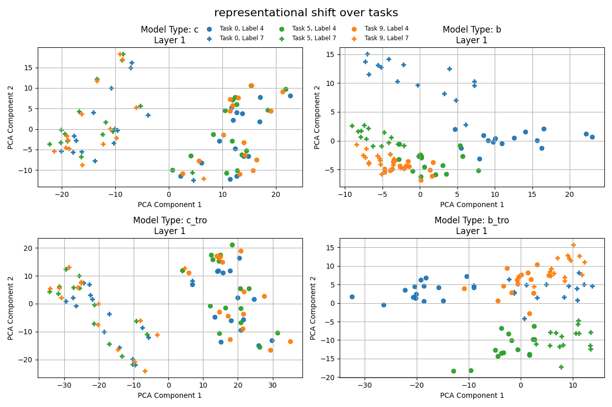
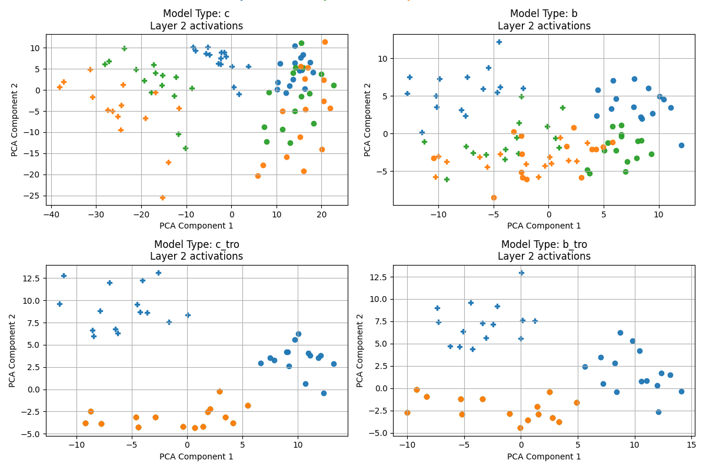
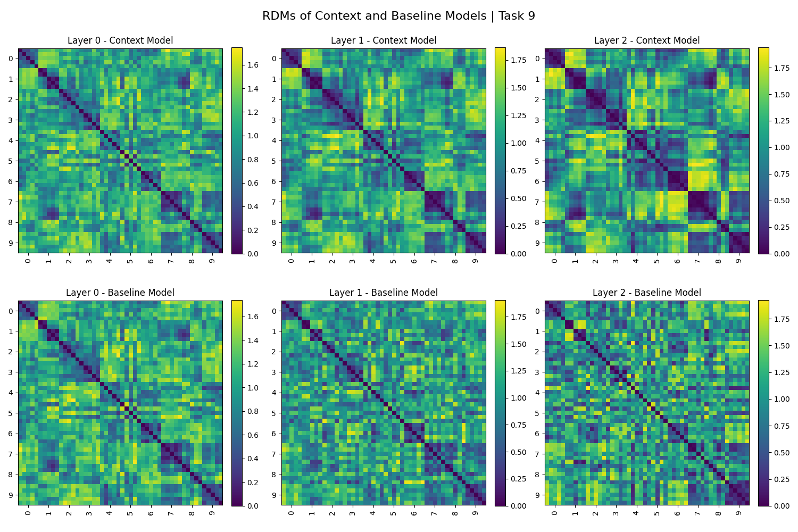
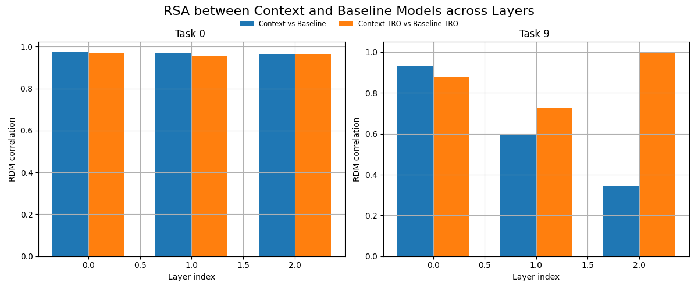

# continual-learning-neuroai

ref:
- Cheung, B., Terekhov, A., Chen, Y., Agrawal, P., & Olshausen, B. (2019, February 14). Superposition of many models into one. arXiv.org. https://arxiv.org/abs/1902.05522

replication results with slight modifications / variations to the original implementation and analysis:

### Performance of superposition model on sequentially learned tasks:

#### control for accuracy on current task (learning is continued):

### representational shift analysis:

### RDMs on later task over layers:

### RSA between context and baseline models:
